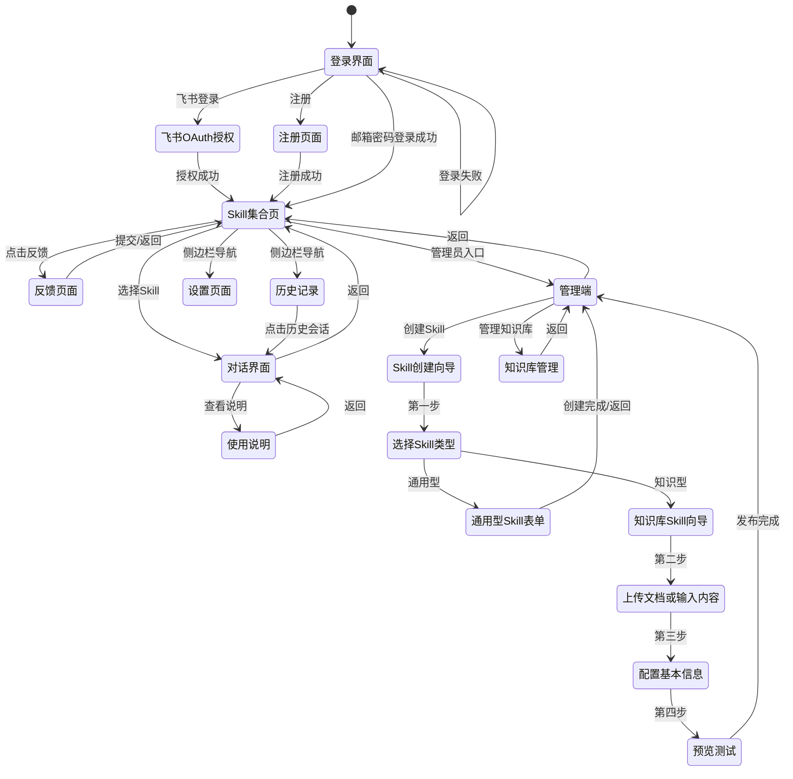

# 设计文档

## 概述

Yeahmobi Everything 是一款基于 Java 的跨平台 AI 桌面应用。采用 JavaFX 作为 UI 框架，客户端本地使用 SQLite 存储对话历史和用户偏好，后端使用 MySQL 存储业务数据、Redis 缓存热点数据，通过 HTTP 与后端服务和大模型 API 通信。应用架构遵循 MVC 模式，将 UI 层、业务逻辑层和数据层清晰分离。界面采用现代简洁风格，左侧导航栏 + 右侧内容区布局，支持浅色/深色主题切换。

Skill 支持两种类型：通用型 Skill（纯 Prompt 驱动）和知识型 Skill（Prompt + 知识库 RAG）。知识库支持文件上传（PDF、Markdown、TXT）和手动输入知识内容。管理员可通过可视化创建向导快速创建 Skill，也可通过命令行集成。Skill 区分"通用"和"内部"两种归属标记，内部 Skill 带公司标识。

技术选型：
- **语言**: Java 17+
- **UI 框架**: JavaFX（跨平台 GUI，支持 FXML 布局和 CSS 样式）
- **构建工具**: Maven
- **客户端本地数据库**: SQLite（通过 sqlite-jdbc，存储对话历史、用户偏好、离线数据）
- **后端关系型数据库**: MySQL（存储用户账号、Skill 配置、知识库元数据、反馈记录等）
- **缓存**: Redis（会话缓存、Skill 列表缓存、热点数据缓存）
- **HTTP 客户端**: Java HttpClient（JDK 内置）
- **JSON 处理**: Gson
- **Markdown 渲染**: flexmark-java（对话中 AI 回复的 Markdown 渲染）
- **打包工具**: jpackage（生成 Windows .msi/.exe 和 macOS .dmg）

## 架构

```mermaid
graph TB
    subgraph 客户端 - JavaFX Desktop App
        UI[UI 层 - JavaFX Views]
        Controller[控制器层]
        Service[服务层]
        LocalRepo[本地数据访问层]
        DB[(SQLite 本地数据库)]
        FileStore[(知识库文件存储)]
    end

    subgraph 后端服务
        Backend[后端 API 服务]
        MySQL[(MySQL 数据库)]
        Redis[(Redis 缓存)]
    end

    subgraph 外部服务
        LLM[大模型 API]
        Feishu[飞书 Webhook]
        FeishuOAuth[飞书 OAuth 2.0]
    end

    UI --> Controller
    Controller --> Service
    Service --> LocalRepo
    LocalRepo --> DB
    LocalRepo --> FileStore
    Service --> Backend
    Backend --> MySQL
    Backend --> Redis
    Service --> LLM
    Service --> Feishu
    Service --> FeishuOAuth
```



应用采用分层架构，数据存储分为客户端本地和后端两部分：

1. **UI 层**: JavaFX FXML 视图 + CSS 样式，负责界面渲染和用户交互
2. **控制器层**: JavaFX Controller，处理 UI 事件，调用服务层
3. **服务层**: 核心业务逻辑，包括认证、Skill 管理、对话、反馈等
4. **本地数据访问层**: 封装 SQLite 操作（对话历史、用户偏好、离线数据）
5. **后端 API 服务**: 处理用户认证、Skill 配置管理、知识库管理、反馈等，使用 MySQL 持久化、Redis 缓存
6. **外部服务**: 大模型 API、飞书 Webhook、飞书 OAuth 2.0



### UI 布局设计

```
┌──────────────────────────────────────────────────┐
│  Yeahmobi Everything                    ─ □ ✕    │
├──────────┬───────────────────────────────────────┤
│          │  🔍 搜索 Skill...                     │
│  ☰ 导航  ├───────────────────────────────────────┤
│          │  ⭐ 我的收藏                           │
│  🏠 Skill│  ┌─────┐ ┌─────┐ ┌─────┐             │
│  📜 历史  │  │翻译  │ │代码  │ │写作  │             │
│  ⭐ 收藏  │  └─────┘ └─────┘ └─────┘             │
│  💬 反馈  ├───────────────────────────────────────┤
│  ⚙ 设置  │  🕐 最近使用                           │
│          │  ┌─────┐ ┌─────┐                      │
│  ─────── │  │翻译  │ │数据  │                      │
│  🔧 管理  │  └─────┘ └─────┘                      │
│ (管理员)  ├───────────────────────────────────────┤
│          │  📂 全部分类                            │
│          │  [翻译] [写作] [开发] [数据] [其他]     │
│          │  ┌─────┐ ┌─────┐ ┌─────┐ ┌─────┐     │
│          │  │Skill │ │Skill │ │Skill │ │Skill │     │
│          │  │  A   │ │  B   │ │  C   │ │  D   │     │
│          │  └─────┘ └─────┘ └─────┘ └─────┘     │
└──────────┴───────────────────────────────────────┘
```

设计风格要点：
- **设计风格**: GitHub 风格商务极简，大量留白，清晰的层次感
- **主色调**: `#1F883D`（GitHub 绿，用于主要操作按钮、成功状态、收藏标记）
- **辅助色**: `#0969DA`（GitHub 蓝，用于链接、选中状态、导航高亮）
- **浅色模式**: 背景 `#FFFFFF`、次级背景 `#F6F8FA`（极浅灰）、边框 `#D0D7DE`、文字 `#1F2328`、次级文字 `#656D76`
- **深色模式**: 背景 `#0D1117`、次级背景 `#161B22`、边框 `#30363D`、文字 `#E6EDF3`、次级文字 `#8B949E`
- **卡片式布局**: Skill 以卡片形式展示，1px 边框 `#D0D7DE`，悬停时边框变为 `#0969DA`，无过度阴影
- **左侧导航栏**: 固定宽度，背景 `#F6F8FA`，图标 + 文字，当前页面左侧绿色指示条
- **对话界面**: 气泡式聊天布局，用户消息靠右（`#DDF4FF` 浅蓝背景 / 深色 `#1F6FEB30`），AI 回复靠左（`#F6F8FA` 浅灰背景 / 深色 `#161B22`），支持 Markdown 渲染
- **按钮**: 主要按钮绿色背景 `#1F883D` + 白色文字，次要按钮灰色边框 `#D0D7DE` + 深色文字
- **响应式**: 窗口缩放时卡片自动重排，最小窗口尺寸 800x600
- **字体**: 系统默认字体（Windows: Microsoft YaHei、macOS: PingFang SC），正文 14px，标题 16-20px

## 组件与接口

### 1. 认证模块 (AuthService)

```java
public interface AuthService {
    /** 邮箱密码登录，返回认证结果 */
    AuthResult loginWithEmail(String email, String password);
    
    /** 飞书 OAuth 登录：使用授权码换取用户信息并创建会话 */
    AuthResult loginWithFeishu(String authorizationCode);
    
    /** 获取飞书 OAuth 授权 URL */
    String getFeishuOAuthUrl();
    
    /** 邮箱注册：发送验证码 */
    boolean sendVerificationCode(String email);
    
    /** 邮箱注册：验证验证码并创建账号 */
    AuthResult register(String email, String verificationCode, String password);
    
    /** 检查本地是否有有效会话 */
    Optional<Session> getStoredSession();
    
    /** 退出登录，清除本地会话 */
    void logout();
}

public record AuthResult(boolean success, String message, Session session) {}
public record Session(String token, String userId, String username, String email, String loginType, long expiresAt) {}
```

### 2. Skill 管理模块 (SkillService)

```java
public interface SkillService {
    /** 从服务端获取所有可用 Skill */
    List<Skill> fetchSkills() throws NetworkException;
    
    /** 根据关键词搜索 Skill */
    List<Skill> searchSkills(String keyword, List<Skill> allSkills);
    
    /** 按分类筛选 Skill */
    List<Skill> filterByCategory(String category, List<Skill> allSkills);
    
    /** 按类型筛选 Skill（全部、通用、内部） */
    List<Skill> filterByType(SkillType type, List<Skill> allSkills);
    
    /** 获取用户收藏的 Skill */
    List<Skill> getFavorites(String userId);
    
    /** 收藏/取消收藏 Skill */
    void toggleFavorite(String userId, String skillId);
    
    /** 获取最近使用的 Skill（按时间倒序） */
    List<Skill> getRecentlyUsed(String userId, int limit);
    
    /** 记录 Skill 使用 */
    void recordUsage(String userId, String skillId);
    
    /** 获取预置的默认 Skill 列表 */
    List<Skill> getDefaultSkills();
}
```

### 3. 对话模块 (ChatService)

```java
public interface ChatService {
    /** 发送用户消息到大模型，返回响应（自动加载 Skill 绑定的知识库内容作为上下文） */
    CompletableFuture<ChatResponse> sendMessage(String skillId, String userMessage, List<ChatMessage> history);
    
    /** 获取某个 Skill 的对话历史 */
    List<ChatMessage> getChatHistory(String skillId);
    
    /** 保存对话消息到本地 */
    void saveMessage(ChatMessage message);
    
    /** 获取所有对话会话列表 */
    List<ChatSession> getAllSessions(String userId);
    
    /** 搜索对话内容 */
    List<ChatSession> searchSessions(String keyword, String userId);
    
    /** 删除某个会话的所有对话 */
    void deleteSession(String sessionId);
    
    /** 构建包含知识库上下文的大模型请求 */
    String buildContextWithKnowledge(String skillId, String userMessage);
}

public record ChatMessage(String id, String sessionId, String skillId, String role, String content, long timestamp) {}
public record ChatResponse(String content, boolean success, String errorMessage) {}
public record ChatSession(String id, String skillId, String skillName, String lastMessage, long lastTimestamp) {}
```

### 4. 反馈模块 (FeedbackService)

```java
public interface FeedbackService {
    /** 提交用户反馈 */
    FeedbackResult submitFeedback(String content, String username);
}

public record Feedback(String id, String username, String content, long timestamp, String status) {}
public record FeedbackResult(boolean success, String message) {}
```

### 5. 管理端模块 (AdminService)

```java
public interface AdminService {
    /** 获取所有 Skill（含管理信息） */
    List<SkillAdmin> getAllSkills();
    
    /** 通过命令行参数集成新 Skill */
    SkillIntegrationResult integrateSkill(String command);
    
    /** 通过表单模板创建通用型 Skill */
    SkillIntegrationResult createSkillFromTemplate(SkillTemplate template);
    
    /** 通过知识库向导创建知识型 Skill */
    SkillIntegrationResult createKnowledgeSkill(KnowledgeSkillTemplate template);
    
    /** 启用或禁用 Skill */
    void toggleSkillStatus(String skillId, boolean enabled);
    
    /** 获取所有反馈 */
    List<Feedback> getAllFeedbacks();
    
    /** 标记反馈为已处理 */
    void markFeedbackProcessed(String feedbackId);
}

public record SkillAdmin(String id, String name, String description, String icon, String category,
    boolean enabled, SkillType type, SkillKind kind, String promptTemplate, long createdAt) {}
public record SkillIntegrationResult(boolean success, String message, SkillAdmin skill) {}
public record SkillTemplate(String name, String description, String category, String icon,
    SkillType type, String promptTemplate) {}
public record KnowledgeSkillTemplate(String name, String description, String category, String icon,
    SkillType type, String promptTemplate, List<String> knowledgeFileIds, String manualKnowledgeContent) {}

/** Skill 归属类型 */
public enum SkillType {
    GENERAL,   // 通用 Skill
    INTERNAL   // 内部 Skill，带公司标识
}

/** Skill 驱动类型 */
public enum SkillKind {
    PROMPT_ONLY,    // 通用型 Skill：纯 Prompt 驱动
    KNOWLEDGE_RAG   // 知识型 Skill：Prompt + 知识库 RAG
}
```

### 6. 知识库管理模块 (KnowledgeBaseService)

```java
public interface KnowledgeBaseService {
    /** 上传知识库文件，提取文本内容 */
    KnowledgeFile uploadFile(File file) throws FileProcessingException;
    
    /** 批量上传知识库文件 */
    List<KnowledgeFile> uploadFiles(List<File> files) throws FileProcessingException;
    
    /** 通过手动输入创建知识库条目 */
    KnowledgeFile createFromManualInput(String title, String content);
    
    /** 更新已有知识库文件（替换内容，重新提取文本） */
    KnowledgeFile updateFile(String fileId, File newFile) throws FileProcessingException;
    
    /** 更新手动输入的知识库内容 */
    KnowledgeFile updateManualContent(String fileId, String content);
    
    /** 删除知识库文件（同时解除所有 Skill 绑定） */
    void deleteFile(String fileId);
    
    /** 获取所有知识库文件列表 */
    List<KnowledgeFile> getAllFiles();
    
    /** 绑定知识库文件到 Skill */
    void bindFileToSkill(String skillId, String fileId);
    
    /** 解除 Skill 与知识库文件的绑定 */
    void unbindFileFromSkill(String skillId, String fileId);
    
    /** 获取 Skill 绑定的所有知识库文件 */
    List<KnowledgeFile> getFilesForSkill(String skillId);
    
    /** 获取 Skill 绑定的所有知识库文件的合并文本内容 */
    String getMergedKnowledgeText(String skillId);
    
    /** 验证文件格式是否支持 */
    boolean isSupportedFormat(String fileName);
    
    /** 从文件中提取文本内容 */
    String extractText(File file) throws FileProcessingException;
}

public class FileProcessingException extends Exception {
    public FileProcessingException(String message) { super(message); }
    public FileProcessingException(String message, Throwable cause) { super(message, cause); }
}
```

### 6. 飞书通知模块 (FeishuNotifier)

```java
public interface FeishuNotifier {
    /** 通过飞书 Webhook 发送反馈通知 */
    boolean sendFeedbackNotification(Feedback feedback);
}
```

### 7. 本地存储模块 (LocalRepository)

```java
/** 客户端本地 SQLite 存储 */
public interface SessionRepository {
    void saveSession(Session session);
    Optional<Session> loadSession();
    void clearSession();
}

public interface ChatRepository {
    void saveMessage(ChatMessage message);
    List<ChatMessage> getHistory(String sessionId);
    void clearHistory(String sessionId);
    List<ChatSession> getAllSessions(String userId);
    List<ChatSession> searchSessions(String keyword, String userId);
    void deleteSession(String sessionId);
}

public interface FavoriteRepository {
    void addFavorite(String userId, String skillId);
    void removeFavorite(String userId, String skillId);
    List<String> getFavoriteSkillIds(String userId);
    boolean isFavorite(String userId, String skillId);
}

public interface UsageRepository {
    void recordUsage(String userId, String skillId);
    List<String> getRecentSkillIds(String userId, int limit);
}

public interface SettingsRepository {
    void saveSetting(String key, String value);
    Optional<String> getSetting(String key);
}
```

### 8. 后端 MySQL 数据访问模块

```java
/** 后端 MySQL 存储 */
public interface UserRepository {
    void createUser(User user);
    Optional<User> findByEmail(String email);
    Optional<User> findByFeishuUserId(String feishuUserId);
    Optional<User> findById(String userId);
}

public record User(String id, String email, String passwordHash, String username,
    String feishuUserId, String loginType, long createdAt) {}

public interface SkillRepository {
    void saveSkill(SkillAdmin skill);
    Optional<SkillAdmin> getSkill(String skillId);
    List<SkillAdmin> getAllSkills();
    void updateSkill(SkillAdmin skill);
    void deleteSkill(String skillId);
}

public interface KnowledgeFileRepository {
    void saveFile(KnowledgeFile file);
    Optional<KnowledgeFile> getFile(String fileId);
    List<KnowledgeFile> getAllFiles();
    void updateFile(KnowledgeFile file);
    void deleteFile(String fileId);
}

public interface SkillKnowledgeBindingRepository {
    void bind(String skillId, String fileId);
    void unbind(String skillId, String fileId);
    void unbindAllForFile(String fileId);
    List<String> getFileIdsForSkill(String skillId);
    List<String> getSkillIdsForFile(String fileId);
}

public interface FeedbackRepository {
    void saveFeedback(Feedback feedback);
    List<Feedback> getAllFeedbacks();
    Optional<Feedback> getFeedback(String feedbackId);
    void updateFeedbackStatus(String feedbackId, String status, long processedAt);
}
```

### 9. Redis 缓存模块

```java
public interface CacheService {
    /** 缓存用户会话 */
    void cacheSession(String token, Session session, long ttlSeconds);
    
    /** 获取缓存的会话 */
    Optional<Session> getCachedSession(String token);
    
    /** 删除缓存的会话 */
    void removeCachedSession(String token);
    
    /** 缓存 Skill 列表 */
    void cacheSkillList(List<Skill> skills, long ttlSeconds);
    
    /** 获取缓存的 Skill 列表 */
    Optional<List<Skill>> getCachedSkillList();
    
    /** 清除 Skill 列表缓存 */
    void invalidateSkillCache();
    
    /** 缓存知识库合并文本 */
    void cacheKnowledgeText(String skillId, String text, long ttlSeconds);
    
    /** 获取缓存的知识库文本 */
    Optional<String> getCachedKnowledgeText(String skillId);
    
    /** 清除指定 Skill 的知识库缓存 */
    void invalidateKnowledgeCache(String skillId);
}
```

## 数据模型

### 客户端 SQLite 数据库表结构（本地存储）

客户端 SQLite 用于存储对话历史、用户偏好设置和离线缓存数据。

```sql
-- 本地会话缓存表
CREATE TABLE local_session (
    id INTEGER PRIMARY KEY AUTOINCREMENT,
    token TEXT NOT NULL,
    user_id TEXT NOT NULL,
    username TEXT NOT NULL,
    email TEXT,
    login_type TEXT NOT NULL CHECK(login_type IN ('email', 'feishu')),
    expires_at INTEGER NOT NULL
);

-- 对话会话表
CREATE TABLE chat_session (
    id TEXT PRIMARY KEY,
    user_id TEXT NOT NULL,
    skill_id TEXT NOT NULL,
    skill_name TEXT NOT NULL,
    last_message TEXT,
    last_timestamp INTEGER NOT NULL
);

CREATE INDEX idx_session_user ON chat_session(user_id);

-- 对话历史表
CREATE TABLE chat_message (
    id TEXT PRIMARY KEY,
    session_id TEXT NOT NULL,
    skill_id TEXT NOT NULL,
    role TEXT NOT NULL CHECK(role IN ('user', 'assistant')),
    content TEXT NOT NULL,
    timestamp INTEGER NOT NULL,
    FOREIGN KEY (session_id) REFERENCES chat_session(id) ON DELETE CASCADE
);

CREATE INDEX idx_chat_session ON chat_message(session_id);
CREATE INDEX idx_chat_skill ON chat_message(skill_id);
CREATE INDEX idx_chat_timestamp ON chat_message(timestamp);

-- 用户收藏表（本地缓存）
CREATE TABLE favorite (
    user_id TEXT NOT NULL,
    skill_id TEXT NOT NULL,
    created_at INTEGER NOT NULL,
    PRIMARY KEY (user_id, skill_id)
);

-- Skill 使用记录表（本地缓存）
CREATE TABLE skill_usage (
    id INTEGER PRIMARY KEY AUTOINCREMENT,
    user_id TEXT NOT NULL,
    skill_id TEXT NOT NULL,
    used_at INTEGER NOT NULL
);

CREATE INDEX idx_usage_user ON skill_usage(user_id, used_at);

-- 用户设置表
CREATE TABLE settings (
    key TEXT PRIMARY KEY,
    value TEXT NOT NULL
);
```

### 后端 MySQL 数据库表结构

MySQL 用于存储用户账号、Skill 配置、知识库元数据、反馈记录等业务数据。

```sql
-- 用户账号表
CREATE TABLE user (
    id VARCHAR(36) PRIMARY KEY,
    email VARCHAR(255) UNIQUE,
    password_hash VARCHAR(255),
    username VARCHAR(100) NOT NULL,
    feishu_user_id VARCHAR(100) UNIQUE,
    login_type ENUM('email', 'feishu') NOT NULL,
    created_at TIMESTAMP DEFAULT CURRENT_TIMESTAMP,
    updated_at TIMESTAMP DEFAULT CURRENT_TIMESTAMP ON UPDATE CURRENT_TIMESTAMP
) ENGINE=InnoDB DEFAULT CHARSET=utf8mb4;

CREATE INDEX idx_user_email ON user(email);
CREATE INDEX idx_user_feishu ON user(feishu_user_id);

-- Skill 配置表
CREATE TABLE skill (
    id VARCHAR(36) PRIMARY KEY,
    name VARCHAR(100) NOT NULL,
    description TEXT NOT NULL,
    icon VARCHAR(255),
    category VARCHAR(50) NOT NULL,
    enabled BOOLEAN DEFAULT TRUE,
    usage_guide TEXT,
    skill_type ENUM('GENERAL', 'INTERNAL') DEFAULT 'GENERAL',
    skill_kind ENUM('PROMPT_ONLY', 'KNOWLEDGE_RAG') DEFAULT 'PROMPT_ONLY',
    prompt_template TEXT,
    created_at TIMESTAMP DEFAULT CURRENT_TIMESTAMP,
    updated_at TIMESTAMP DEFAULT CURRENT_TIMESTAMP ON UPDATE CURRENT_TIMESTAMP
) ENGINE=InnoDB DEFAULT CHARSET=utf8mb4;

CREATE INDEX idx_skill_category ON skill(category);
CREATE INDEX idx_skill_type ON skill(skill_type);
CREATE INDEX idx_skill_kind ON skill(skill_kind);

-- 知识库文件表
CREATE TABLE knowledge_file (
    id VARCHAR(36) PRIMARY KEY,
    file_name VARCHAR(255) NOT NULL,
    file_type VARCHAR(10) NOT NULL,
    file_size BIGINT NOT NULL,
    file_path VARCHAR(500) NOT NULL,
    source_type ENUM('upload', 'manual') DEFAULT 'upload',
    extracted_text LONGTEXT,
    uploaded_at TIMESTAMP DEFAULT CURRENT_TIMESTAMP,
    updated_at TIMESTAMP DEFAULT CURRENT_TIMESTAMP ON UPDATE CURRENT_TIMESTAMP
) ENGINE=InnoDB DEFAULT CHARSET=utf8mb4;

-- Skill 与知识库文件关联表
CREATE TABLE skill_knowledge_binding (
    skill_id VARCHAR(36) NOT NULL,
    knowledge_file_id VARCHAR(36) NOT NULL,
    bound_at TIMESTAMP DEFAULT CURRENT_TIMESTAMP,
    PRIMARY KEY (skill_id, knowledge_file_id),
    FOREIGN KEY (skill_id) REFERENCES skill(id) ON DELETE CASCADE,
    FOREIGN KEY (knowledge_file_id) REFERENCES knowledge_file(id) ON DELETE CASCADE
) ENGINE=InnoDB DEFAULT CHARSET=utf8mb4;

CREATE INDEX idx_binding_skill ON skill_knowledge_binding(skill_id);
CREATE INDEX idx_binding_file ON skill_knowledge_binding(knowledge_file_id);

-- 用户反馈表
CREATE TABLE feedback (
    id VARCHAR(36) PRIMARY KEY,
    user_id VARCHAR(36) NOT NULL,
    username VARCHAR(100) NOT NULL,
    content TEXT NOT NULL,
    status ENUM('pending', 'processed') DEFAULT 'pending',
    processed_at TIMESTAMP NULL,
    created_at TIMESTAMP DEFAULT CURRENT_TIMESTAMP,
    FOREIGN KEY (user_id) REFERENCES user(id)
) ENGINE=InnoDB DEFAULT CHARSET=utf8mb4;

CREATE INDEX idx_feedback_user ON feedback(user_id);
CREATE INDEX idx_feedback_status ON feedback(status);
CREATE INDEX idx_feedback_time ON feedback(created_at);
```

### Redis 缓存策略

```
# 用户会话缓存（登录后存储，设置过期时间）
session:{token} -> JSON(Session) TTL=7d

# Skill 列表缓存（全量缓存，Skill 变更时清除）
skills:all -> JSON(List<Skill>) TTL=10m

# 单个 Skill 缓存
skill:{skillId} -> JSON(Skill) TTL=10m

# 知识库文本缓存（避免重复读取文件）
knowledge:{skillId} -> String(mergedText) TTL=30m
```

### Skill 数据模型

```java
public record Skill(
    String id,
    String name,
    String description,
    String icon,
    String category,
    boolean enabled,
    String usageGuide,      // 使用说明：详细功能描述、适用场景
    List<String> examples,  // 输入示例
    SkillType type,         // Skill 归属类型：GENERAL（通用）或 INTERNAL（内部）
    SkillKind kind,         // Skill 驱动类型：PROMPT_ONLY（通用型）或 KNOWLEDGE_RAG（知识型）
    String promptTemplate   // Prompt 模板：定义 Skill 与大模型交互的提示词
) {}

public enum SkillType {
    GENERAL,   // 通用 Skill
    INTERNAL   // 内部 Skill，带公司标识
}

public enum SkillKind {
    PROMPT_ONLY,    // 通用型 Skill：纯 Prompt 驱动
    KNOWLEDGE_RAG   // 知识型 Skill：Prompt + 知识库 RAG
}
```

### 知识库数据模型

```java
public record KnowledgeFile(
    String id,
    String fileName,
    String fileType,        // pdf, md, txt
    long fileSize,
    String sourceType,      // "upload"（文件上传）或 "manual"（手动输入）
    String extractedText,   // 提取的文本内容（文件上传）或手动输入的内容
    long uploadedAt,
    long updatedAt
) {}

public record SkillKnowledgeBinding(
    String skillId,
    String knowledgeFileId,
    long boundAt
) {}
```

### 反馈飞书消息格式

```json
{
    "msg_type": "interactive",
    "card": {
        "header": {
            "title": { "tag": "plain_text", "content": "新用户反馈" }
        },
        "elements": [
            { "tag": "div", "text": { "tag": "plain_text", "content": "用户: {username}" } },
            { "tag": "div", "text": { "tag": "plain_text", "content": "时间: {timestamp}" } },
            { "tag": "div", "text": { "tag": "plain_text", "content": "内容: {content}" } }
        ]
    }
}
```


## 正确性属性

*属性（Property）是一种在系统所有有效执行中都应成立的特征或行为——本质上是关于系统应该做什么的形式化陈述。属性是人类可读规范与机器可验证正确性保证之间的桥梁。*

### Property 1: 邮箱密码登录结果与凭证有效性一致

*For any* 邮箱和密码组合，AuthService.loginWithEmail 的返回结果中 success 字段应与凭证的有效性一致：有效凭证返回 success=true 且包含非空 Session（含 loginType="email"），无效凭证返回 success=false 且 Session 为空。

**Validates: Requirements 1.4, 1.5**

### Property 2: 会话存储 round-trip

*For any* 有效的 Session 对象（无论 loginType 为 "email" 或 "feishu"），通过 SessionRepository.saveSession 保存后，SessionRepository.loadSession 应返回与原始 Session 等价的对象。

**Validates: Requirements 1.10**

### Property 3: 退出登录清除会话

*For any* 已保存的 Session，调用 logout 后，SessionRepository.loadSession 应返回 Optional.empty()。

**Validates: Requirements 1.11**

### Property 4: Skill 搜索过滤正确性

*For any* Skill 列表和任意搜索关键词，searchSkills 返回的结果应满足：(a) 结果中每个 Skill 的名称或描述包含该关键词，(b) 原列表中名称或描述包含该关键词的 Skill 都出现在结果中。

**Validates: Requirements 2.3**

### Property 5: Skill 分类筛选正确性

*For any* Skill 列表和任意分类标签，filterByCategory 返回的结果中每个 Skill 的 category 字段应与筛选分类一致，且原列表中属于该分类的 Skill 都出现在结果中。

**Validates: Requirements 2.4**

### Property 6: 收藏 round-trip

*For any* 用户和 Skill，调用 addFavorite 后，isFavorite 应返回 true，且 getFavoriteSkillIds 应包含该 Skill ID。

**Validates: Requirements 2.5**

### Property 7: 最近使用排序

*For any* 用户使用记录序列，getRecentlyUsed 返回的列表应按使用时间倒序排列，且不超过指定的 limit 数量。

**Validates: Requirements 2.6**

### Property 8: 大模型请求构造完整性

*For any* 用户输入文本、Skill ID 和对话历史，ChatService 构造的请求应同时包含用户输入内容和 Skill 上下文信息。

**Validates: Requirements 3.2**

### Property 9: 对话历史 round-trip

*For any* ChatMessage 序列，通过 ChatRepository.saveMessage 逐条保存后，ChatRepository.getHistory 返回的列表应包含所有已保存的消息，且内容与原始消息等价。

**Validates: Requirements 3.6, 7.1, 7.2**

### Property 10: 飞书通知消息完整性

*For any* Feedback 对象，FeishuNotifier 构造的飞书消息应包含反馈的用户名称、提交时间和反馈内容。

**Validates: Requirements 4.3, 4.6**

### Property 11: Skill 集成命令解析 round-trip

*For any* 有效的 Skill 集成命令字符串，解析后生成的 SkillAdmin 对象再序列化回命令格式，应产生等价的命令。

**Validates: Requirements 5.3**

### Property 12: Skill 状态切换一致性

*For any* Skill 和目标状态（启用/禁用），调用 toggleSkillStatus 后查询该 Skill，其 enabled 字段应与目标状态一致。

**Validates: Requirements 5.4**

### Property 13: 反馈列表时间倒序

*For any* 反馈列表，getAllFeedbacks 返回的列表中每个相邻元素的 timestamp 应满足前一个大于等于后一个（倒序排列）。

**Validates: Requirements 5.5**

### Property 14: 反馈状态更新

*For any* 反馈，调用 markFeedbackProcessed 后查询该反馈，其状态应为"已处理"且处理时间不为空。

**Validates: Requirements 5.6**

### Property 15: 用户设置 round-trip

*For any* 设置键值对（key, value），通过 SettingsRepository.saveSetting 保存后，SettingsRepository.getSetting 应返回与原始 value 相同的值。

**Validates: Requirements 7.3**

### Property 16: 历史记录时间倒序

*For any* 用户的对话会话集合，getAllSessions 返回的列表应按 lastTimestamp 倒序排列。

**Validates: Requirements 8.2**

### Property 17: 历史记录搜索正确性

*For any* 关键词和对话会话集合，searchSessions 返回的每个会话应至少包含一条内容匹配该关键词的消息。

**Validates: Requirements 8.4**

### Property 18: 历史记录删除

*For any* 对话会话，调用 deleteSession 后，getAllSessions 返回的列表不应包含该会话，且该会话的所有消息也应被删除。

**Validates: Requirements 8.5**

### Property 19: 知识库文件绑定 round-trip

*For any* Skill 和任意数量的知识库文件，通过 bindFileToSkill 绑定后，getFilesForSkill 返回的文件列表应包含所有已绑定的文件，且文件数量与绑定数量一致。

**Validates: Requirements 13.1, 13.5**

### Property 20: 知识库文件解绑正确性

*For any* 已绑定知识库文件的 Skill，调用 unbindFileFromSkill 解除某个文件的绑定后，getFilesForSkill 返回的列表不应包含该文件，但其他绑定文件仍然存在。

**Validates: Requirements 13.4**

### Property 21: 知识库文件格式验证

*For any* 文件名，isSupportedFormat 应在且仅在文件扩展名为 pdf、md 或 txt 时返回 true，其他扩展名返回 false。

**Validates: Requirements 13.2, 14.5**

### Property 22: 知识库上下文构建完整性

*For any* 绑定了知识库文件的 Skill 和任意用户输入，buildContextWithKnowledge 构造的上下文字符串应同时包含用户输入内容和所有绑定知识库文件的提取文本。

**Validates: Requirements 13.3**

### Property 23: 文本提取 round-trip

*For any* 有效的 TXT 或 Markdown 文件内容，上传文件后 extractedText 字段应包含原始文件的文本内容。

**Validates: Requirements 13.6, 14.2**

### Property 24: 知识库文件更新保留绑定

*For any* 已绑定到 Skill 的知识库文件，调用 updateFile 更新文件内容后，该文件与 Skill 的绑定关系应保持不变，但 extractedText 应更新为新文件的内容。

**Validates: Requirements 14.3**

### Property 25: 知识库文件删除级联

*For any* 绑定到一个或多个 Skill 的知识库文件，调用 deleteFile 后，该文件应从 getAllFiles 列表中消失，且所有相关 Skill 的 getFilesForSkill 结果不再包含该文件。

**Validates: Requirements 14.4**

### Property 26: Skill 模板创建 round-trip

*For any* 有效的 SkillTemplate（包含名称、描述、分类、类型），通过 createSkillFromTemplate 创建后，getAllSkills 返回的列表应包含一个与模板字段一致的 Skill，且该 Skill 的 enabled 状态为 true，kind 为 PROMPT_ONLY。

**Validates: Requirements 15.6, 15.10, 15.11**

### Property 27: Skill 模板必填字段验证

*For any* 缺少名称、描述或分类中任一必填字段的 SkillTemplate，createSkillFromTemplate 应返回 success=false 的结果，且不创建 Skill。

**Validates: Requirements 15.7**

### Property 28: 模板创建自动绑定知识库

*For any* 包含知识库文件 ID 列表的 KnowledgeSkillTemplate，通过 createKnowledgeSkill 创建成功后，getFilesForSkill 返回的文件列表应包含模板中指定的所有知识库文件，且 Skill 的 kind 为 KNOWLEDGE_RAG。

**Validates: Requirements 15.8**

### Property 29: Prompt 模板渲染完整性

*For any* Prompt_模板字符串和示例用户输入，模板渲染结果应同时包含模板中的固定文本和用户输入内容。

**Validates: Requirements 15.5**

### Property 30: Skill 类型筛选正确性

*For any* Skill 列表和指定的 SkillType，filterByType 返回的结果中每个 Skill 的 type 字段应与筛选类型一致，且原列表中属于该类型的 Skill 都出现在结果中。

**Validates: Requirements 17.2**

### Property 31: 注册后登录 round-trip

*For any* 有效的邮箱、验证码和密码组合，通过 register 注册成功后，使用相同的邮箱和密码调用 loginWithEmail 应返回 success=true。

**Validates: Requirements 1.8**

### Property 32: 无效验证码拒绝注册

*For any* 无效或已过期的验证码，调用 register 应返回 success=false，且不创建用户账号。

**Validates: Requirements 1.9**

### Property 33: 批量上传文件数量一致性

*For any* 有效文件列表（所有文件格式均为 PDF、Markdown 或 TXT），调用 uploadFiles 返回的 KnowledgeFile 列表长度应与输入文件列表长度一致。

**Validates: Requirements 15.4**

### Property 34: 手动输入知识内容 round-trip

*For any* 标题和文本内容，通过 createFromManualInput 创建后，getFile 返回的 KnowledgeFile 的 extractedText 应与输入内容一致，sourceType 应为 "manual"。

**Validates: Requirements 15.5**

### Property 35: Redis 会话缓存 round-trip

*For any* 有效的 Session 对象和 token，通过 CacheService.cacheSession 缓存后，CacheService.getCachedSession 应返回与原始 Session 等价的对象。

**Validates: Requirements 16.5**

### Property 36: Skill 变更后缓存失效

*For any* Skill 配置变更操作（创建、更新、启用/禁用），操作完成后 CacheService.getCachedSkillList 应返回 Optional.empty()（缓存已被清除）。

**Validates: Requirements 16.4**

## 错误处理

### 网络错误
- 所有 HTTP 请求使用统一的异常处理机制
- 网络不可用时，Service 层抛出 `NetworkException`，Controller 层捕获并显示用户友好的错误提示
- 提供重试机制，用户可手动触发重试

### 大模型服务错误
- 大模型 API 超时设置为 30 秒
- 超时或服务不可用时，ChatService 返回 `ChatResponse(success=false, errorMessage="...")`
- UI 层根据错误类型显示对应提示

### 本地数据库错误
- SQLite 操作使用 try-with-resources 确保连接正确关闭
- 数据库初始化失败时，应用显示错误对话框并退出
- 数据读写异常时，记录日志并向用户提示

### 飞书 Webhook 错误
- Webhook 调用失败不影响反馈提交的成功状态
- 失败时记录日志，管理员可通过管理端查看未发送的通知

### 认证错误
- Token 过期时，自动清除本地会话和 Redis 缓存并跳转登录界面
- 飞书 OAuth 授权失败时，显示授权失败提示并返回登录界面
- 邮箱注册验证码过期或无效时，显示错误提示并允许重新发送
- 网络错误导致认证失败时，提示用户检查网络连接

### MySQL 数据库错误
- MySQL 连接失败时，后端服务返回 503 状态码，客户端显示服务不可用提示
- 数据库操作异常时，记录日志并返回通用错误响应
- 连接池耗尽时，排队等待或返回繁忙提示

### Redis 缓存错误
- Redis 连接失败时，降级为直接查询 MySQL，不影响核心功能
- 缓存读写异常时，记录警告日志，继续正常业务流程
- Redis 不可用不应导致服务中断，仅影响响应速度

### 知识库文件处理错误
- 不支持的文件格式上传时，抛出 `FileProcessingException`，UI 层显示格式错误提示
- PDF 文本提取失败时，记录日志并允许管理员手动输入文本内容
- 文件大小超限时，拒绝上传并提示管理员
- 知识库文件读取失败时，对话模块跳过该文件的上下文注入，记录警告日志

## 测试策略

### 测试框架

- **单元测试**: JUnit 5
- **属性测试**: jqwik（Java 属性测试库）
- **Mock 框架**: Mockito

### 双重测试方法

本项目采用单元测试和属性测试相结合的方式：

**单元测试**：
- 验证具体示例和边界情况
- 测试 UI 组件的初始状态和导航行为
- 测试错误处理路径（网络错误、服务不可用等）
- 测试集成点（飞书 Webhook 调用、大模型 API 调用）

**属性测试**：
- 验证跨所有输入的通用属性
- 每个属性测试至少运行 100 次迭代
- 每个属性测试必须引用设计文档中的属性编号
- 标签格式: **Feature: yeahmobi-everything, Property {number}: {property_text}**
- 每个正确性属性由一个独立的属性测试实现

### 属性测试配置

```java
@Property(tries = 100)
// Feature: yeahmobi-everything, Property 1: 登录结果与凭证有效性一致
void loginResultConsistency(@ForAll @From("validCredentials") Credentials creds) {
    // 测试实现
}
```

### 测试覆盖范围

| 属性编号 | 测试类型 | 测试目标 |
|---------|---------|---------|
| Property 1 | 属性测试 | AuthService 邮箱密码登录逻辑 |
| Property 2 | 属性测试 | SessionRepository round-trip |
| Property 3 | 属性测试 | 退出登录清除会话 |
| Property 4 | 属性测试 | SkillService 搜索过滤 |
| Property 5 | 属性测试 | SkillService 分类筛选 |
| Property 6 | 属性测试 | FavoriteRepository round-trip |
| Property 7 | 属性测试 | UsageRepository 最近使用排序 |
| Property 8 | 属性测试 | ChatService 请求构造 |
| Property 9 | 属性测试 | ChatRepository round-trip |
| Property 10 | 属性测试 | FeishuNotifier 消息构造 |
| Property 11 | 属性测试 | 命令解析 round-trip |
| Property 12 | 属性测试 | Skill 状态切换 |
| Property 13 | 属性测试 | 反馈列表排序 |
| Property 14 | 属性测试 | 反馈状态更新 |
| Property 15 | 属性测试 | SettingsRepository round-trip |
| Property 16 | 属性测试 | 历史记录排序 |
| Property 17 | 属性测试 | 历史记录搜索 |
| Property 18 | 属性测试 | 历史记录删除 |
| Property 19 | 属性测试 | 知识库文件绑定 round-trip |
| Property 20 | 属性测试 | 知识库文件解绑 |
| Property 21 | 属性测试 | 知识库文件格式验证 |
| Property 22 | 属性测试 | 知识库上下文构建 |
| Property 23 | 属性测试 | 文本提取 round-trip |
| Property 24 | 属性测试 | 知识库文件更新保留绑定 |
| Property 25 | 属性测试 | 知识库文件删除级联 |
| Property 26 | 属性测试 | Skill 模板创建 round-trip |
| Property 27 | 属性测试 | Skill 模板必填字段验证 |
| Property 28 | 属性测试 | 模板创建自动绑定知识库 |
| Property 29 | 属性测试 | Prompt 模板渲染 |
| Property 30 | 属性测试 | Skill 类型筛选 |
| Property 31 | 属性测试 | 注册后登录 round-trip |
| Property 32 | 属性测试 | 无效验证码拒绝注册 |
| Property 33 | 属性测试 | 批量上传文件数量一致性 |
| Property 34 | 属性测试 | 手动输入知识内容 round-trip |
| Property 35 | 属性测试 | Redis 会话缓存 round-trip |
| Property 36 | 属性测试 | Skill 变更后缓存失效 |

### 单元测试重点

- 登录界面初始状态验证（飞书登录按钮、邮箱密码表单、注册入口）
- 飞书 OAuth 授权流程（URL 生成、授权码交换）
- 邮箱注册流程（验证码发送、验证码校验、账号创建）
- 无效凭证的各种边界情况（空邮箱、空密码、格式错误的邮箱、特殊字符）
- 网络错误时的 UI 行为
- 大模型服务超时处理
- 飞书 Webhook 发送失败处理
- SQLite 本地数据库初始化和迁移
- MySQL 连接池管理和异常处理
- Redis 连接失败降级处理
- 知识库 Skill 创建向导的分步流程验证
- 批量文件上传和手动输入知识内容
- 跨平台系统托盘适配

## 项目结构

```
yeahmobi-everything/
├── pom.xml                               # Maven 构建配置
├── mvnw / mvnw.cmd                       # Maven Wrapper
├── README.md                             # 项目文档
├── Dockerfile                            # 后端服务容器化配置
├── docker-compose.yml                    # MySQL + Redis + 后端服务编排
├── .gitignore                            # Git 忽略规则
├── scripts/
│   ├── init.sh                           # Linux/macOS 初始化脚本
│   ├── init.bat                          # Windows 初始化脚本
│   └── application.properties.template   # 配置文件模板
├── src/
│   ├── main/
│   │   ├── java/com/yeahmobi/everything/
│   │   │   ├── App.java                  # 应用入口
│   │   │   ├── auth/                     # 认证模块
│   │   │   │   ├── AuthService.java
│   │   │   │   ├── AuthServiceImpl.java
│   │   │   │   ├── FeishuOAuthService.java
│   │   │   │   ├── AuthController.java
│   │   │   │   └── Session.java
│   │   │   ├── skill/                    # Skill 模块
│   │   │   │   ├── Skill.java
│   │   │   │   ├── SkillType.java
│   │   │   │   ├── SkillKind.java
│   │   │   │   ├── SkillService.java
│   │   │   │   ├── SkillServiceImpl.java
│   │   │   │   └── SkillController.java
│   │   │   ├── chat/                     # 对话模块
│   │   │   │   ├── ChatMessage.java
│   │   │   │   ├── ChatSession.java
│   │   │   │   ├── ChatService.java
│   │   │   │   ├── ChatServiceImpl.java
│   │   │   │   └── ChatController.java
│   │   │   ├── feedback/                 # 反馈模块
│   │   │   │   ├── Feedback.java
│   │   │   │   ├── FeedbackService.java
│   │   │   │   ├── FeedbackServiceImpl.java
│   │   │   │   └── FeedbackController.java
│   │   │   ├── admin/                    # 管理端模块
│   │   │   │   ├── AdminService.java
│   │   │   │   ├── AdminServiceImpl.java
│   │   │   │   ├── AdminController.java
│   │   │   │   ├── SkillCommandParser.java
│   │   │   │   └── SkillWizardController.java
│   │   │   ├── knowledge/               # 知识库模块
│   │   │   │   ├── KnowledgeFile.java
│   │   │   │   ├── KnowledgeBaseService.java
│   │   │   │   ├── KnowledgeBaseServiceImpl.java
│   │   │   │   └── KnowledgeController.java
│   │   │   ├── notification/             # 通知模块
│   │   │   │   ├── FeishuNotifier.java
│   │   │   │   └── FeishuNotifierImpl.java
│   │   │   ├── repository/              # 数据访问层
│   │   │   │   ├── local/               # 客户端本地 SQLite
│   │   │   │   │   ├── LocalDatabaseManager.java
│   │   │   │   │   ├── SessionRepository.java
│   │   │   │   │   ├── ChatRepository.java
│   │   │   │   │   ├── FavoriteRepository.java
│   │   │   │   │   ├── UsageRepository.java
│   │   │   │   │   └── SettingsRepository.java
│   │   │   │   ├── mysql/               # 后端 MySQL
│   │   │   │   │   ├── MySQLDatabaseManager.java
│   │   │   │   │   ├── UserRepository.java
│   │   │   │   │   ├── SkillRepository.java
│   │   │   │   │   ├── KnowledgeFileRepository.java
│   │   │   │   │   ├── SkillKnowledgeBindingRepository.java
│   │   │   │   │   └── FeedbackRepository.java
│   │   │   │   └── cache/               # Redis 缓存
│   │   │   │       ├── RedisManager.java
│   │   │   │       └── CacheService.java
│   │   │   └── common/                   # 公共模块
│   │   │       ├── Config.java
│   │   │       ├── NetworkException.java
│   │   │       └── HttpClientUtil.java
│   │   └── resources/
│   │       ├── application.properties    # 应用配置
│   │       ├── fxml/                     # FXML 布局文件
│   │       │   ├── login.fxml
│   │       │   ├── register.fxml
│   │       │   ├── main.fxml
│   │       │   ├── chat.fxml
│   │       │   ├── feedback.fxml
│   │       │   ├── history.fxml
│   │       │   ├── settings.fxml
│   │       │   ├── admin.fxml
│   │       │   └── skill-wizard.fxml
│   │       ├── css/                      # 样式文件
│   │       │   ├── light-theme.css
│   │       │   └── dark-theme.css
│   │       ├── images/                   # 图标和图片资源
│   │       └── sql/
│   │           ├── init-local.sql        # 客户端 SQLite 初始化
│   │           └── init-mysql.sql        # 后端 MySQL 初始化
│   └── test/
│       └── java/com/yeahmobi/everything/
│           ├── auth/
│           │   └── AuthServiceTest.java
│           ├── skill/
│           │   └── SkillServiceTest.java
│           ├── chat/
│           │   └── ChatServiceTest.java
│           ├── feedback/
│           │   └── FeedbackServiceTest.java
│           ├── admin/
│           │   └── AdminServiceTest.java
│           ├── knowledge/
│           │   └── KnowledgeBaseServiceTest.java
│           ├── notification/
│           │   └── FeishuNotifierTest.java
│           └── repository/
│               ├── SessionRepositoryTest.java
│               ├── ChatRepositoryTest.java
│               ├── FavoriteRepositoryTest.java
│               ├── UsageRepositoryTest.java
│               ├── SettingsRepositoryTest.java
│               └── CacheServiceTest.java
```

## 构建与打包

### Maven 构建配置

```xml
<project xmlns="http://maven.apache.org/POM/4.0.0"
         xmlns:xsi="http://www.w3.org/2001/XMLSchema-instance"
         xsi:schemaLocation="http://maven.apache.org/POM/4.0.0 http://maven.apache.org/xsd/maven-4.0.0.xsd">
    <modelVersion>4.0.0</modelVersion>

    <groupId>com.yeahmobi</groupId>
    <artifactId>yeahmobi-everything</artifactId>
    <version>1.0.0</version>
    <packaging>jar</packaging>

    <properties>
        <maven.compiler.source>17</maven.compiler.source>
        <maven.compiler.target>17</maven.compiler.target>
        <javafx.version>17</javafx.version>
        <project.build.sourceEncoding>UTF-8</project.build.sourceEncoding>
    </properties>

    <dependencies>
        <!-- JavaFX -->
        <dependency>
            <groupId>org.openjfx</groupId>
            <artifactId>javafx-controls</artifactId>
            <version>${javafx.version}</version>
        </dependency>
        <dependency>
            <groupId>org.openjfx</groupId>
            <artifactId>javafx-fxml</artifactId>
            <version>${javafx.version}</version>
        </dependency>
        <dependency>
            <groupId>org.openjfx</groupId>
            <artifactId>javafx-web</artifactId>
            <version>${javafx.version}</version>
        </dependency>

        <!-- Database -->
        <dependency>
            <groupId>org.xerial</groupId>
            <artifactId>sqlite-jdbc</artifactId>
            <version>3.45.1.0</version>
        </dependency>
        <dependency>
            <groupId>com.mysql</groupId>
            <artifactId>mysql-connector-j</artifactId>
            <version>8.3.0</version>
        </dependency>
        <dependency>
            <groupId>redis.clients</groupId>
            <artifactId>jedis</artifactId>
            <version>5.1.0</version>
        </dependency>

        <!-- JSON & Markdown -->
        <dependency>
            <groupId>com.google.code.gson</groupId>
            <artifactId>gson</artifactId>
            <version>2.10.1</version>
        </dependency>
        <dependency>
            <groupId>com.vladsch.flexmark</groupId>
            <artifactId>flexmark-all</artifactId>
            <version>0.64.8</version>
        </dependency>

        <!-- Testing -->
        <dependency>
            <groupId>org.junit.jupiter</groupId>
            <artifactId>junit-jupiter</artifactId>
            <version>5.10.2</version>
            <scope>test</scope>
        </dependency>
        <dependency>
            <groupId>net.jqwik</groupId>
            <artifactId>jqwik</artifactId>
            <version>1.8.3</version>
            <scope>test</scope>
        </dependency>
        <dependency>
            <groupId>org.mockito</groupId>
            <artifactId>mockito-core</artifactId>
            <version>5.10.0</version>
            <scope>test</scope>
        </dependency>
    </dependencies>

    <build>
        <plugins>
            <plugin>
                <groupId>org.openjfx</groupId>
                <artifactId>javafx-maven-plugin</artifactId>
                <version>0.0.8</version>
                <configuration>
                    <mainClass>com.yeahmobi.everything.App</mainClass>
                </configuration>
            </plugin>
            <plugin>
                <groupId>org.panteleyev</groupId>
                <artifactId>jpackage-maven-plugin</artifactId>
                <version>1.6.5</version>
                <configuration>
                    <name>Yeahmobi Everything</name>
                    <appVersion>1.0.0</appVersion>
                    <mainClass>com.yeahmobi.everything.App</mainClass>
                    <mainJar>yeahmobi-everything-1.0.0.jar</mainJar>
                </configuration>
            </plugin>
            <plugin>
                <groupId>org.apache.maven.plugins</groupId>
                <artifactId>maven-surefire-plugin</artifactId>
                <version>3.2.5</version>
            </plugin>
        </plugins>
    </build>
</project>
```

### 打包命令

```bash
# 构建可执行 JAR
./mvnw package

# 生成 Windows 安装包
./mvnw jpackage:jpackage -Djpackage.type=msi

# 生成 macOS 安装包
./mvnw jpackage:jpackage -Djpackage.type=dmg
```

## 部署与初始化

### 配置文件 (application.properties)

```properties
# 大模型 API 配置
llm.api.url=https://api.example.com/v1/chat
llm.api.key=YOUR_API_KEY
llm.api.timeout=30000

# 飞书配置
feishu.webhook.url=https://open.feishu.cn/open-apis/bot/v2/hook/YOUR_HOOK_ID
feishu.oauth.app_id=YOUR_FEISHU_APP_ID
feishu.oauth.app_secret=YOUR_FEISHU_APP_SECRET
feishu.oauth.redirect_uri=http://localhost:8080/auth/feishu/callback

# 后端 API 配置
backend.api.url=https://api.yeahmobi.com/everything

# MySQL 数据库配置
mysql.url=jdbc:mysql://localhost:3306/yeahmobi_everything?useSSL=false&characterEncoding=utf8mb4
mysql.username=root
mysql.password=YOUR_MYSQL_PASSWORD

# Redis 缓存配置
redis.host=localhost
redis.port=6379
redis.password=YOUR_REDIS_PASSWORD
redis.database=0

# 客户端本地 SQLite 数据库配置
db.local.path=${user.home}/.yeahmobi-everything/data.db

# 应用配置
app.name=Yeahmobi Everything
app.version=1.0.0
app.theme=light
```

### 初始化脚本功能

初始化脚本（init.sh / init.bat）执行以下操作：
1. 检查 Java 17+ 运行环境
2. 创建应用数据目录 `~/.yeahmobi-everything/`
3. 初始化客户端本地 SQLite 数据库并执行 init-local.sql
4. 初始化后端 MySQL 数据库并执行 init-mysql.sql（创建数据库和表结构）
5. 检查 Redis 连接可用性
6. 从模板生成 application.properties（提示用户填写 API Key、MySQL/Redis 连接信息等配置）
7. 预置默认 Skill 数据（翻译助手、文案撰写、代码助手、数据分析）

### Docker 部署（后端 API + MySQL + Redis）

```dockerfile
FROM eclipse-temurin:17-jre-alpine
WORKDIR /app
COPY target/yeahmobi-everything-*.jar app.jar
EXPOSE 8080
ENTRYPOINT ["java", "-jar", "app.jar"]
```

```yaml
# docker-compose.yml
version: '3.8'
services:
  mysql:
    image: mysql:8.0
    environment:
      MYSQL_ROOT_PASSWORD: ${MYSQL_ROOT_PASSWORD}
      MYSQL_DATABASE: yeahmobi_everything
      MYSQL_CHARACTER_SET_SERVER: utf8mb4
    ports:
      - "3306:3306"
    volumes:
      - mysql_data:/var/lib/mysql
      - ./src/main/resources/sql/init-mysql.sql:/docker-entrypoint-initdb.d/init.sql

  redis:
    image: redis:7-alpine
    command: redis-server --requirepass ${REDIS_PASSWORD}
    ports:
      - "6379:6379"
    volumes:
      - redis_data:/data

  backend:
    build: .
    ports:
      - "8080:8080"
    depends_on:
      - mysql
      - redis
    environment:
      MYSQL_URL: jdbc:mysql://mysql:3306/yeahmobi_everything
      MYSQL_USERNAME: root
      MYSQL_PASSWORD: ${MYSQL_ROOT_PASSWORD}
      REDIS_HOST: redis
      REDIS_PORT: 6379
      REDIS_PASSWORD: ${REDIS_PASSWORD}

volumes:
  mysql_data:
  redis_data:
```
