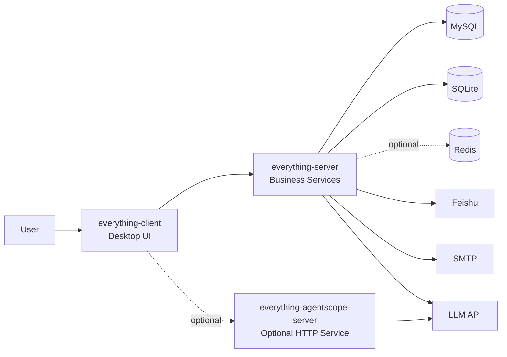
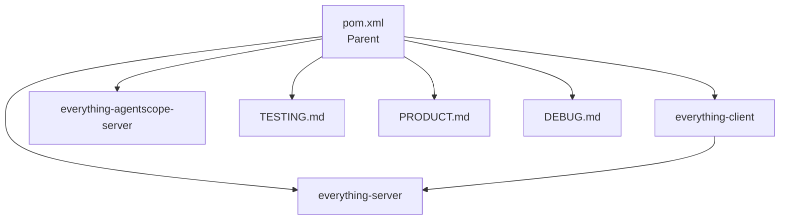
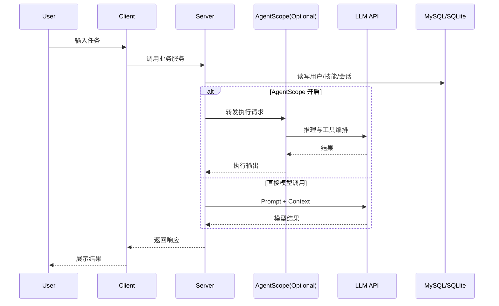

# Yeahmobi Everything

[](#)
[](#)
[](#)

面向企业内部场景的 AI 桌面工作台。  
通过 `Skill + Chat + Knowledge + Agent` 组合，帮助团队把日常任务从“问答”走向“可执行”。

---

## 目录

- [项目概览](#项目概览)
- [功能特性](#功能特性)
- [架构与模块](#架构与模块)
- [可点击架构图](#可点击架构图)
- [技术栈](#技术栈)
- [快速开始](#快速开始)
- [配置说明](#配置说明)
- [运行与构建](#运行与构建)
- [测试](#测试)
- [常见问题](#常见问题)
- [文档索引](#文档索引)
- [License](#license)

---

## 项目概览

`Yeahmobi Everything` 是一个 Maven 多模块 Java 项目，运行形态为：

- 桌面端主应用：`everything-client`（JavaFX）
- 业务能力模块：`everything-server`（认证、技能、知识库、聊天、数据访问）
- 可选 Agent 服务：`everything-agentscope-server`（HTTP API，多智能体执行）

> 说明：本项目不是传统前后端分离 Web 架构，而是“桌面应用 + 内嵌服务 + 可选独立 Agent 服务”。

## 功能特性

- 认证体系：邮箱注册/登录、飞书 OAuth 登录
- Skill 平台：分类、搜索、收藏、最近使用、个人 Skill、审核流、技能市场
- 对话能力：多轮上下文、Prompt 模板化
- 知识库能力：Skill 绑定知识文件，问答时自动注入上下文
- 通知能力：飞书应用机器人消息、SMTP 验证码邮件
- 执行能力：本机 CLI Gateway、任务跟进（Work Followup）
- 扩展能力：AgentScope 工具编排（Web 检索、MCP 桥接、Docx 等）

## 架构与模块

### 模块职责

| 模块 | 职责 | 运行方式 |
|---|---|---|
| `everything-client` | JavaFX UI、应用入口、页面控制器 | Fat JAR / 原生安装包 |
| `everything-server` | 业务核心：Auth、Skill、Chat、Knowledge、Repository | 作为依赖被客户端调用 |
| `everything-agentscope-server` | AgentScope HTTP 接口、多智能体执行 | 可独立启动 |

### 仓库结构

```text
yeahmobiEverything/
├── pom.xml
├── everything-client/
├── everything-server/
├── everything-agentscope-server/
├── TESTING.md
├── PRODUCT.md
└── README.md
```

## 可点击架构图

> 说明：以下图使用 Mermaid，节点可点击跳转到对应目录或文档（在 GitHub 页面直接点击节点）。

### 1) 系统上下文图



### 2) 模块依赖图



### 3) 请求与执行流（简化）



## 技术栈

- Java 17
- JavaFX 21
- Maven 多模块
- SQLite（本地存储）
- MySQL（业务主库）
- Redis（可选缓存）
- Gson / Jackson
- JUnit 5 + jqwik + Mockito

---

## 快速开始

### 1. 环境要求

必需：
- JDK 17+
- MySQL 8+
- 可用的大模型 API（`llm.api.*`）

可选：
- Redis（缓存增强）
- SMTP（验证码邮件）
- 飞书开放平台应用（OAuth + 消息通知）

### 2. 初始化数据库

```bash
mysql -u root -p
```

```sql
CREATE DATABASE yeahmobi_everything CHARACTER SET utf8mb4 COLLATE utf8mb4_unicode_ci;
SOURCE everything-server/src/main/resources/sql/init-mysql.sql;
```

### 3. 准备配置文件

项目读取：`everything-server/src/main/resources/application.properties`

```bash
cp everything-server/src/main/resources/application_tmp.properties \
   everything-server/src/main/resources/application.properties
```

最小必填配置：

```properties
llm.api.url=
llm.api.key=
llm.api.model=

mysql.url=jdbc:mysql://localhost:3306/yeahmobi_everything?useSSL=false&characterEncoding=utf8mb4
mysql.username=
mysql.password=
```

### 4. 构建并启动

首次构建（推荐）：

```bash
./mvnw clean install -DskipTests
```

日常运行：

```bash
./mvnw clean verify -DskipTests
java -jar everything-client/target/yeahmobi-everything-1.0.0-all.jar
```

快速脚本：

```bash
./dev.sh
```

---

## 配置说明

以下键位于 `application.properties`。

### 必填

| 键 | 说明 |
|---|---|
| `llm.api.url` | 大模型 API 地址 |
| `llm.api.key` | 大模型 API Key |
| `llm.api.model` | 模型名 |
| `mysql.url` | MySQL 连接串 |
| `mysql.username` | MySQL 用户名 |
| `mysql.password` | MySQL 密码 |

### 常用可选

| 键 | 说明 |
|---|---|
| `redis.host` / `redis.port` | Redis 连接配置 |
| `smtp.*` | 验证码邮件发送配置 |
| `feishu.oauth.app_id` / `feishu.oauth.app_secret` | 飞书 OAuth |
| `feishu.admin.user_id` / `feishu.admin.user_id_type` | 飞书应用机器人接收人 |
| `agentscope.enabled` | 是否启用 AgentScope |
| `agentscope.server.port` | AgentScope 服务端口（默认 8099） |

---

## 运行与构建

### 桌面端（主入口）

- 入口类：`com.yeahmobi.everything.Launcher`
- 产物：`everything-client/target/yeahmobi-everything-1.0.0-all.jar`

### AgentScope 服务（可选）

```bash
./mvnw -pl everything-agentscope-server -am -DskipTests package
java -jar everything-agentscope-server/target/everything-agentscope-server-1.0.0.jar
```

主要接口：

- `GET /health`
- `POST /api/agentscope/execute`
- `POST /api/agentscope/execute/stream`
- `POST /api/agentscope/multi-agent/execute`
- `POST /api/agentscope/multi-agent/stream`

### 打包命令

Fat JAR：

```bash
./mvnw clean verify -DskipTests
```

原生安装包（jpackage）：

```bash
./mvnw jpackage:jpackage -pl everything-client
```

- macOS 产物：`.dmg`
- Windows 产物：`.msi`（需 WiX Toolset）

CI 工作流：`.github/workflows/build.yml`

---

## 测试

全量测试：

```bash
./mvnw test
```

更多测试策略见：`TESTING.md`

---

## 常见问题

**Q1：`.gitignore` 已更新，但文件仍被提交？**  
A：`.gitignore` 只对未跟踪文件生效。对已跟踪文件执行 `git rm --cached` 后再提交。

**Q2：不配置 SMTP 可以注册吗？**  
A：可以走降级逻辑（验证码不经邮件发送），生产环境建议配置 SMTP。

**Q3：Redis 是必需的吗？**  
A：不是。系统支持无 Redis 退化运行。

---

## 文档索引

- `PRODUCT.md`：产品与能力设计
- `TESTING.md`：测试策略与验证方式
- `DEBUG.md`：调试指南
- `HR_*`：HR 场景设计与验收文档

## License

Internal use only - Yeahmobi.
